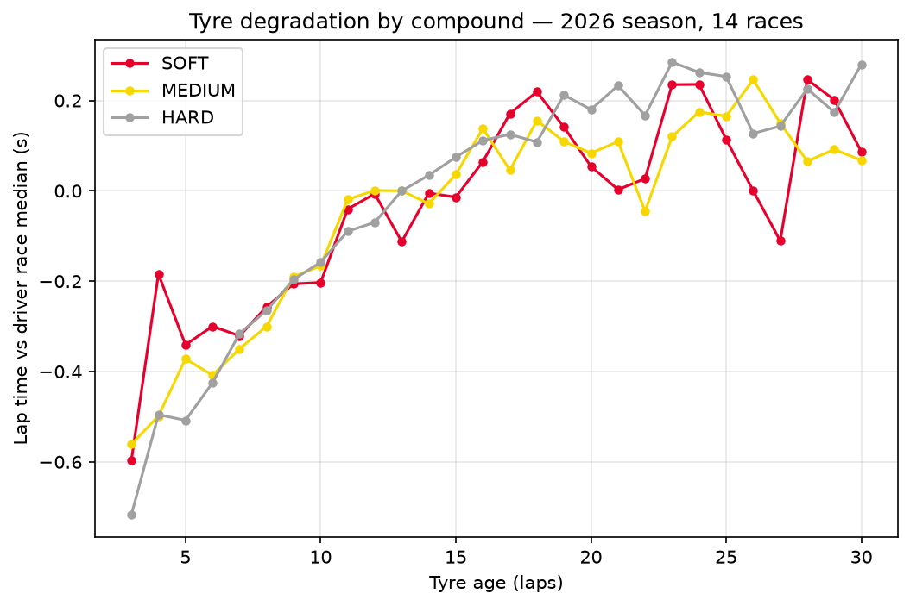
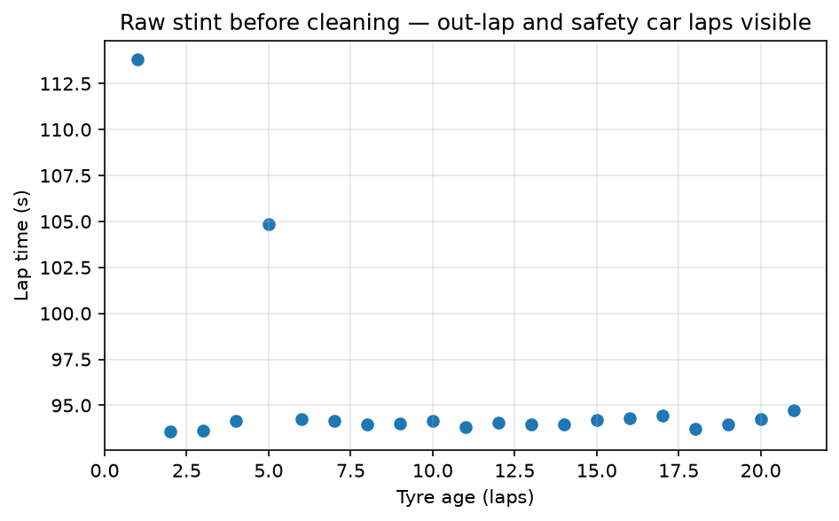
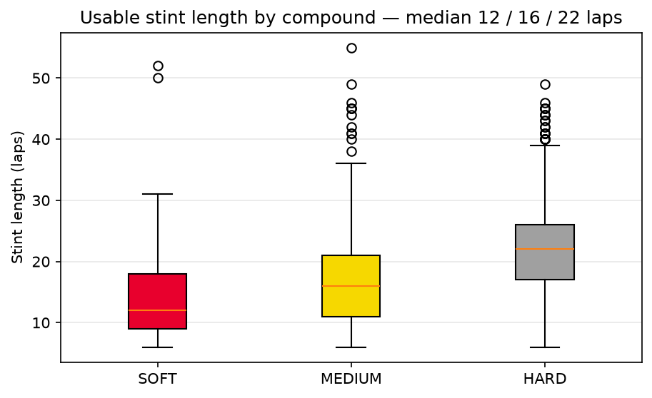

# F1 Tyre Degradation Model — 2026 Season

Measuring how much lap time F1 cars lose to tyre wear, using timing data from 14 races
of the 2026 season.

## Headline

Soft, medium and hard tyres degrade at similar measured rates — around 0.05 seconds per
lap. What separates them is usable life: a soft stint runs 12 laps, a medium 16, a hard
22. Teams pit once a tyre drops off, so each compound is only ever observed while it is
still working. The difference between compounds is lifespan, not rate of decline.

| Compound | Stints | Median rate | Median stint |
|---|---:|---:|---:|
| SOFT | 121 | 0.051 s/lap | 12 laps |
| MEDIUM | 253 | 0.060 s/lap | 16 laps |
| HARD | 285 | 0.051 s/lap | 22 laps |

**Biggest caveat:** absolute rates are conditional on an assumed fuel effect of
0.05 s/lap. Only the comparisons between compounds are assumption-free.



---

## The data

14 races from the 2026 season, pulled from the
[FastF1](https://github.com/theOehrly/Fast-F1) API. 16,255 laps, 22 drivers.

I used 2026 only. The regulations changed that year — new power units, new aero, new
Pirelli tyres — so a 2026 car wears its tyres differently to a 2025 one. Mixing seasons
would mean modelling two sets of physics at once.

---

## Cleaning the data

The effect I am measuring is about 0.05 seconds per lap. Lap times move by much more
than that for reasons unrelated to tyres. A pit stop costs twenty seconds, a safety car
thirty, traffic one to three.

Left in, that noise dwarfs the signal and the model explains safety cars instead of tyre
wear. I removed every lap whose slowness had a known cause other than the tyre.

| Filter | Removed | Left |
|---|---:|---:|
| Missing lap time | 291 | 15,964 |
| Wet / intermediate tyres | 39 | 15,925 |
| Out-laps | 499 | 15,426 |
| In-laps | 511 | 14,915 |
| Not green flag the whole lap | 1,488 | 13,427 |
| Lap 1 | 165 | 13,262 |
| Stints under 5 laps | 101 | 13,161 |
| Missing tyre age | 19 | 13,142 |
| First 2 laps of a stint | 466 | **12,676** |

**12,676 clean laps remain — 22% of the data removed.**



One stint before cleaning. The lap at 113 seconds is the out-lap, which starts in the pit
lane under the speed limit. The lap at 105 seconds is a safety car lap. Everything else
sits around 94 seconds and drifts slowly upward. Two laps out of twenty-two carry twenty
seconds of noise.

**Track status.** FastF1 joins together every flag status that occurred during a lap. So
`'167'` does not mean status 167 — it means the lap started green, a virtual safety car
came out, then it ended. Only laps marked exactly `'1'` were green throughout. Keeping
every lap that merely *contains* a 1 would have retained all the compromised ones. This
was the largest filter: 1,488 laps.

**First two laps of a stint.** A new tyre is not up to temperature, and the driver has
just rejoined into traffic. Those laps are slow for reasons that are not wear.

---

## The fuel problem

Inside a stint, tyre age and lap number rise together, one for one. The tyre ages and
slows the car; fuel burns off and speeds it up. A 2026 car burns about 1.6 kg a lap, and
each kilo is worth about 0.03 seconds — roughly **0.05 seconds per lap** of free pace
from getting lighter.

Every raw lap time is the net of the two. Measure degradation off raw times and the
answer is always too small.

The two cannot be separated statistically, because they never vary independently. They
rise together, every lap, in every stint. The only route out is physics: calculate the
fuel effect separately and subtract it. What remains belongs to the tyre.

```
corrected lap time = raw lap time + 0.05 × (lap number − 1)
```

### Sensitivity to the assumption

The 0.05 is an estimate, not a measurement. I reran the analysis across a range of
values:

| Fuel effect assumed | SOFT | MEDIUM | HARD |
|---|---:|---:|---:|
| 0.03 s/lap | 0.031 | 0.040 | 0.031 |
| 0.04 s/lap | 0.041 | 0.050 | 0.041 |
| 0.05 s/lap | 0.051 | 0.060 | 0.051 |
| 0.06 s/lap | 0.061 | 0.070 | 0.061 |
| 0.07 s/lap | 0.071 | 0.080 | 0.071 |

Every rate moves exactly one-for-one with the assumption, for a mathematical reason.
Inside a stint, lap number is tyre age plus a fixed number. Adding
`fuel × (lap number − 1)` is therefore the same as adding `fuel × tyre age` plus a
constant. Anything multiplied by tyre age goes straight into the slope when a line is
fitted:

```
measured degradation = true slope + assumed fuel coefficient
```

Two consequences:

- **Absolute numbers depend on the assumption.** The data cannot say whether the real
  rate is 0.03 or 0.07. Every figure here means "assuming 0.05 s/lap for fuel".
- **Compound comparisons do not.** Medium sits 0.009 s/lap above the other two at every
  value tested. The fuel term cancels, so the gap is real.

Separating them properly needs laps where tyre age and fuel load vary independently —
the same tyre age at different fuel loads. A within-stint method cannot provide that.

---

## Results

### Degradation rate

I fitted a line to each of 659 stints individually and took the median per compound.

| Compound | Stints | Median rate | Std dev |
|---|---:|---:|---:|
| SOFT | 121 | 0.051 s/lap | 0.222 |
| MEDIUM | 253 | 0.060 s/lap | 0.107 |
| HARD | 285 | 0.051 s/lap | 0.080 |

Fitting per stint rather than pooling all laps of a compound matters. Degradation happens
*within* a stint — it is what one set of tyres does as it ages. Pooling mixes that with
differences between stints: a driver doing 40 laps on hards is nursing the tyre, a driver
doing 10 on softs is pushing. Fitting each stint separately keeps those apart.

### How long each tyre lasts



| Compound | Median stint | Mean stint |
|---|---:|---:|
| SOFT | 12 laps | 14.4 |
| MEDIUM | 16 laps | 17.2 |
| HARD | 22 laps | 22.9 |

This is where the compounds differ, and it explains why the curves overlap. Teams pit
once a tyre has dropped off by a set amount, so each compound is only observed inside the
window where it still works. A 22-lap-old soft never appears because nobody runs one that
long. The steep part of the soft curve is cut out of the data by the strategy that
produced it.

The same fact explains soft's larger standard deviation: short stints mean fewer points
per fit, so noisier estimates.

---

## The model

A gradient boosting model predicting lap time from tyre age and compound. I tested it two
ways, holding out whole groups both times so no lap from a test stint appeared in
training.

| Test set | Baseline | Model | Result |
|---|---:|---:|---|
| Unseen stints, circuits it had seen | 0.655 s | **0.615 s** | 6% better |
| Unseen races, circuits it had not | 0.629 s | 0.716 s | 14% worse |

The baseline predicts the average for every lap and knows nothing about tyres. Without
it, an error figure has no scale.

The gap between those rows is the main result. Degradation is learnable: on circuits it
knows, the model beats guessing. It does not transfer to a new circuit. Bahrain destroys
tyres, Monaco barely touches them, and with only tyre age and compound the model cannot
tell which kind of track it is looking at.

The feature ablation supports this:

| Features | Error (race split) |
|---|---:|
| Baseline | 0.629 s |
| Tyre age + compound | 0.716 s |
| + stint number | 0.719 s |
| + lap number | 0.756 s |
| Tyre age + compound, simpler model | 0.707 s |

Adding lap number makes it worse; simplifying the model makes it better. Both indicate
overfitting. Lap number is the clearest offender: Monaco runs 78 laps and Spa runs 44, so
"lap 50" means late race at one track and mid race at another. The model learns a rule
that is false at the test circuits.

**On splitting.** I held out whole races and whole stints rather than random laps. Under a
random split, lap 12 and lap 13 of the same stint land on opposite sides — same car, same
tyre, a minute apart — and the model scores well while having learned nothing
transferable. Splitting by race is what exposed the problem. A random split would have
hidden it.

Making this work on a new circuit needs features describing the track: surface
abrasiveness, track temperature, layout, average speed. That is why teams run Friday
practice.

---

## What this does not do

- **Traffic is not handled.** A car stuck behind another is slower for reasons unrelated
  to its tyres, and I made no attempt to find or remove those laps. This is the largest
  remaining source of noise.
- **Track evolution is not corrected.** Tracks get faster through a race as rubber goes
  down, pushing every measured slope in the same direction as the fuel effect.
- **No circuit features**, which is why the model fails on unseen tracks.
- **Absolute rates depend on the fuel assumption.** Only compound comparisons are
  assumption-free.
- **Soft results are least reliable**, because soft stints are short.
- **Some tyre ages are reconstructed.** FastF1 reported fixing bad stint data for several
  drivers, so a few values are the library's inference rather than raw timing.
- **One season, 14 races.** The 2026 calendar was incomplete when this was run.

---

## Running it

```bash
git clone https://github.com/xaviercop/f1-tyre-degradation.git
cd f1-tyre-degradation
python3 -m venv venv
source venv/bin/activate
pip install -r requirements.txt
mkdir -p cache results
jupyter notebook notebooks/01-exploration.ipynb
```

The first run downloads every race from the FastF1 API into `cache/`. That takes a few
minutes and a few hundred megabytes. After that it loads in seconds. `cache/` is
gitignored.
